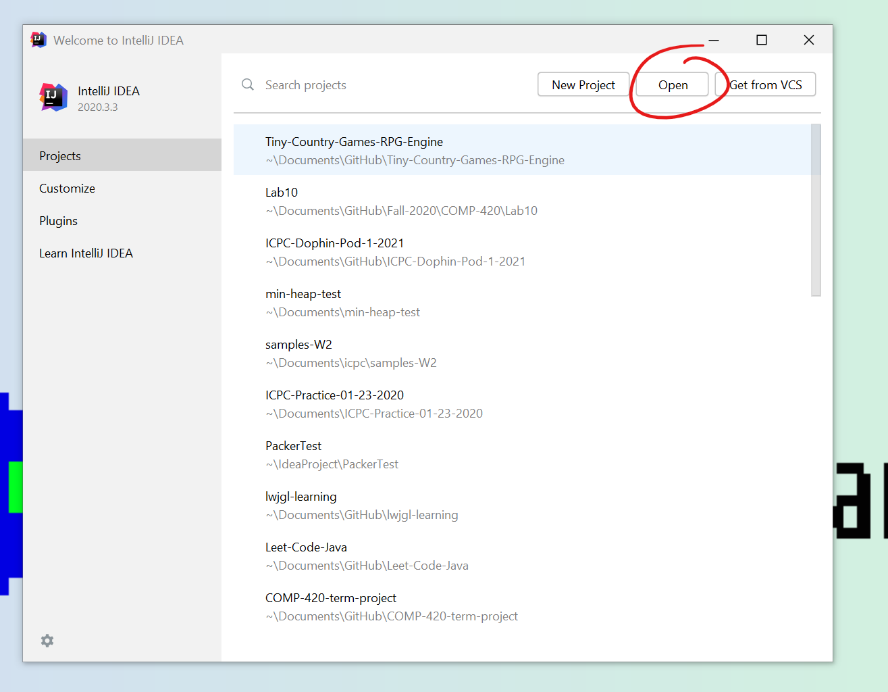
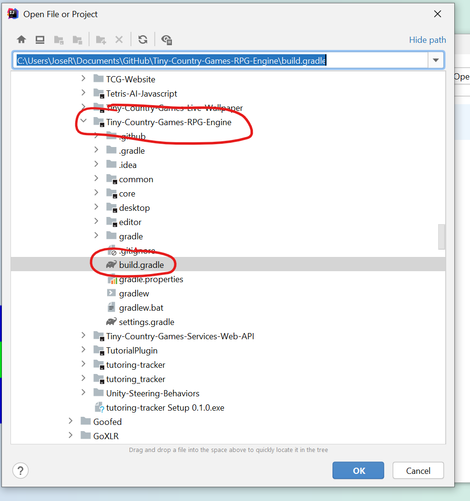
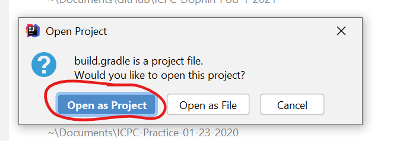
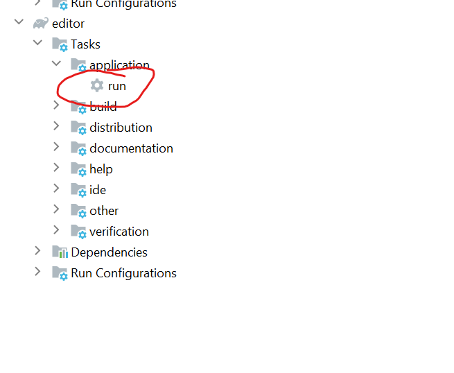

# Tiny-Country-Games-RPG-Engine


By [Jose de Jesus Rodriguez Rivas](https://joserodriguezrivas.com/) - *Class of 2021*


The Tiny Country Games RPG Engine is a desktop application that allows users to create JRPG games without any previous
coding experience. The project was largely inspired by the [RPG Maker Series](https://www.rpgmakerweb.com/). The goal of
the project was for the application to be as easy to use as possible, without sacrificing flexibility. The idea was that
if a beginner wanted to make a game, they could easily, and if a more experienced developer wanted to make a more
complex game, they could use this tool as well. The capstone project was to begin a significant portion of this
application.

## Features Included in Capstone

- Asset Manager
- Global Variable Manager
- Global Flag Manager
- Title Screen Editor
- System Sound Editor
- System UI Skin Editor
- Game Element Editor
- Basic Playable Actor Editor
- Map Editor
- Game Runtime Title Screen
- Game Runtime Map Display

## Features to be Added in Future

- Completed Actor Editor
- Editors for:
    - Items
    - Skils
    - Enemies
    - Classes
    - Races
- Playable character in overworld
- Pause Screen
- Inventory Screen
- Battle System
- Event Editor
- Event Runner

## Developer Guide

### Prerequisites

- [JDK 13+](https://www.rpgmakerweb.com/)

### Initial Setup

1. Clone this repository or a fork of this repository.
2. Open command line and set the cwd to be the root of the repository.
3. Run the following command:

  ```
  gradlew build
  ```

4. Ensure that the build is successful.

### Running the editor

1. Open command line and set the cwd to the root of the repository.
2. Run the following command:

  ```
  gradlew editor:run
  ```

### IntelliJ Setup

1. Run IntelliJ
2. On welcome page, select `Open`
   
3. Select the `build.gradle` file in the ***root*** of the repository, not any of the sub folders.
   
4. Select `Open as Project`
    
5. Once the build process is complete, click on `View -> Tool Windows -> Gradle` and run the `run` task under `editor -> Tasks -> application`
    
   
### Modules

- **Common**: The common module stores the main datastructures that manage the engine, such as the Asset Library, Database.
- **Core**: The core module stores the code for the game runtime. It is written with [libGDX](https://libgdx.com/), which can be learned by starting with their [GitHub Wiki](https://github.com/libgdx/libgdx/wiki).
- **Desktop**: The desktop module mostly stores the main function for the runtime. This wont be used much for development, more so for the deployment of the games.
- **Editor**: The editor module contains a JavaFX application that is the main editor. 

## Acknowledgements

- Capstone Advisor: [Dr. Jason Isaacs](http://isaacs.cs.csuci.edu/index.html) at *[California State University Channel Islands](California State University Channel Islands)*
